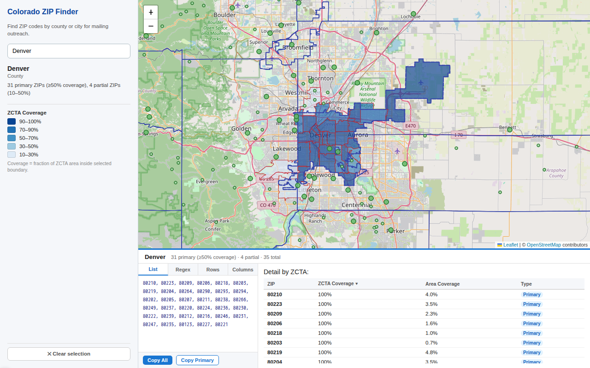

# Colorado ZIP Code Finder

Interactive map tool for finding ZIP codes that approximate Colorado county and city boundaries — useful for targeting mailing list outreach by geography.

Search for any Colorado county or incorporated city, see the matching ZCTAs (Census ZIP Code Tabulation Areas) highlighted on the map with coverage percentages, and copy the ZIP codes in your preferred format.



## Features

- Search by county (e.g. "Boulder County") or city (e.g. "Fort Collins")
- Choropleth map showing ZCTA coverage — how much of each ZIP code falls inside the selected boundary
- Copy ZIPs as comma-separated list, regex (`80301|80302|...`), spreadsheet rows, or spreadsheet columns
- "Copy Primary" button for ZIPs that are mostly inside the boundary (≥50% coverage)
- Hover tooltip: shows county/city under the cursor when browsing, or inside/outside status + ZIP coverage when a selection is active
- Shareable URLs (selection state encoded in the URL)

## Limitations

- **Colorado only** — data is pre-computed for Colorado counties and incorporated cities. Extending to other states would require re-running `setup.py` with different Census files.
- **ZCTAs, not USPS ZIP codes** — the tool uses Census ZIP Code Tabulation Areas, which are approximations of USPS delivery areas. Boundaries may not exactly match what a mailing house uses, and some ZCTAs span multiple counties or cities.
- **Unincorporated communities excluded** — only incorporated cities and towns (Census CLASSFP `C1`) appear in the city search. Census Designated Places (CDPs) like subdivisions and unincorporated communities are not included.
- **2020 ZCTA vintage** — ZCTA geometries are from the 2020 Census. County boundaries are also 2020; city (place) boundaries are from TIGER 2025.
- **Overlap threshold** — a ZCTA is included if ≥10% of the ZCTA's area falls inside the boundary, OR if the ZCTA covers ≥10% of the boundary's area. The second condition ensures large ZCTAs that straddle small cities are included.

## Deployment (fly.io)

```bash
fly launch --no-deploy   # first time only — imports fly.toml
fly deploy               # builds image, runs setup.py, deploys
```

The Docker build runs `setup.py` automatically (~3 min, downloads ~80MB of Census data). Subsequent deploys use Docker layer cache so only code changes trigger a fast rebuild.

## Local Setup

### 1. Install dependencies

Python 3.10+ required. A virtual environment is recommended.

```bash
python -m venv venv
source venv/bin/activate   # Windows: venv\Scripts\activate
pip install -r requirements.txt
```

Dependencies: `flask`, `geopandas`, `shapely`, `pandas`, `requests`, `pyogrio`

### 2. Download data and precompute overlaps

This downloads ~80MB of Census shapefiles and runs spatial intersection analysis (~2–5 minutes). Only needs to be run once.

```bash
python setup.py
```

This creates a `data/` directory with:

| File | Description |
|------|-------------|
| `co_zctas.geojson` | Colorado ZCTA boundaries |
| `co_counties.geojson` | Colorado county boundaries |
| `co_places.geojson` | Colorado incorporated place boundaries |
| `county_zip_overlaps.json` | Precomputed ZCTA overlaps per county |
| `place_zip_overlaps.json` | Precomputed ZCTA overlaps per city |
| `search_index.json` | Autocomplete index (county + city names) |

### 3. Run the web server

```bash
python app.py
```

Then open [http://localhost:5000](http://localhost:5000).

## License

This project is released into the public domain under the [Unlicense](LICENSE). The underlying Census data is also public domain (US federal government work).

## Data Sources

| Dataset | Source | Vintage |
|---------|--------|---------|
| ZCTA boundaries | [US Census GENZ 2020 simplified shapefiles](https://www.census.gov/geographies/mapping-files/time-series/geo/cartographic-boundary.html) | 2020 |
| County boundaries | [US Census GENZ 2020 simplified shapefiles](https://www.census.gov/geographies/mapping-files/time-series/geo/cartographic-boundary.html) | 2020 |
| Place (city) boundaries | [US Census TIGER/Line 2025](https://www.census.gov/geographies/mapping-files/time-series/geo/tiger-line-file.html) | 2025 |

All data is freely available from the US Census Bureau with no attribution requirement.

## How coverage is calculated

Spatial analysis is done in **EPSG:26913** (NAD83 / UTM Zone 13N), which gives accurate area measurements for Colorado.

For each county/city + ZCTA pair that intersects:

- **ZCTA coverage** = intersection area ÷ ZCTA area — *"what fraction of this ZIP code is inside the boundary?"*
- **Area coverage** = intersection area ÷ boundary area — *"what fraction of the boundary is covered by this ZIP code?"*

A ZCTA is included if either metric ≥ 10%. It is marked **primary** if ZCTA coverage ≥ 50%.
